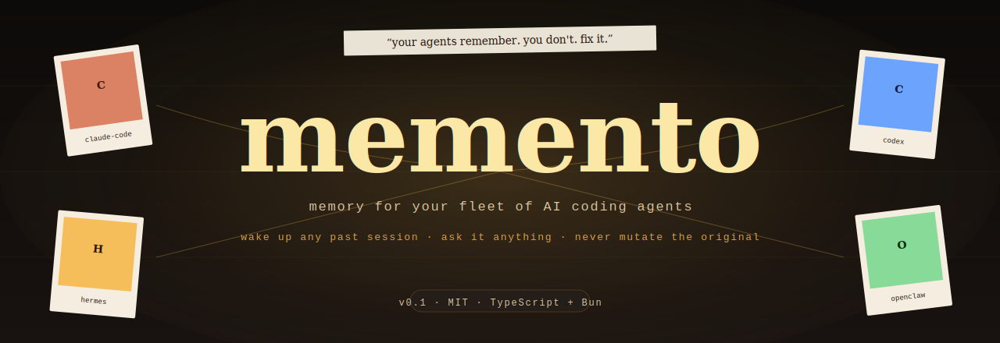
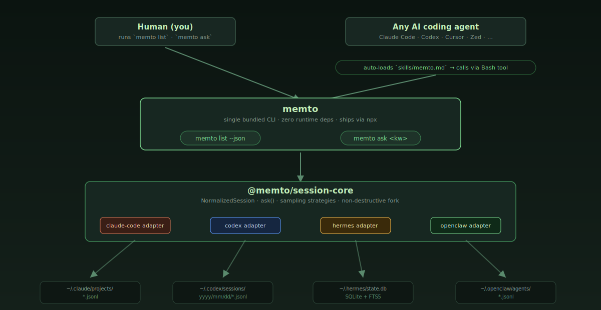

<p align="center">
  
</p>

<h1 align="center">memto 🎞️</h1>

<p align="center">
  <a href="./LICENSE"></a>
  
  
  
  
  
</p>

<p align="center">
  <b>Your AI coding agents all have their own memory. You have none.</b>
</p>

<p align="center">
  <code>memto</code> turns every past session across <b>Claude Code, Codex, Hermes, and OpenClaw</b><br/>
  into a queryable expert you can <b>wake up and ask</b>.
</p>

<p align="center">
  <i>Like the movie — every past AI session is a polaroid you can hold up and ask questions of.<br/>Because your agents remember, and you don't.</i>
</p>

---

## 🎬 The problem

If you run one Claude Code tab at a time, you don't need this.

If you run five — one editing your résumé, one grinding on your startup, one debugging a customer issue, one doing research, one filing your taxes — then today the answer to *"where is the LaTeX file for my résumé?"* lives in exactly **one** agent's head.

The other four have no idea. You, the human, are the only thing connecting them, and your short-term memory is the bottleneck.

`memto` fixes this. Every past session becomes an **askable expert**. When you need something, you (or more often, the agent you're currently talking to) lists the fleet, picks the one who knows, forks it non-destructively, asks a question, and gets an answer grounded in the full context that original session built up.

> **No RAG. No embeddings. No extracted "facts" that lose all their nuance. Memory is the original agent, woken up.**

---

## ✨ Features

| | |
|---|---|
| 🎞️ **4 runtimes, one view** | Claude Code, Codex, Hermes, and OpenClaw — all normalized into the same `NormalizedSession` shape. One API reads them all. |
| 🌱 **Non-destructive by default** | Every `ask` forks the target session. The original is never mutated. Fork artifacts are cleaned up automatically. |
| ⚡ **Under 1 second to scan everything** | ~440 MB/s over your entire `~/.claude`, `~/.codex`, `~/.hermes`, `~/.openclaw`. |
| 🎛 **Configurable prompt sampling** | 7 strategies (`evenly-spaced` / `first-n` / `last-n` / `head-and-tail` / `every-nth` / `all` / `none`) for `sampled_user_prompts`. |
| 🤖 **Agent-native** | `--json` on every command. Ships a markdown skill so Claude Code / Codex / Cursor auto-discover when to call `memto ask`. No daemon, no protocol overhead — just a CLI your agents already know how to run. |
| ⏱ **Auto-scaled timeouts** | 120s floor + 1s per MB of transcript. 60 MB Claude sessions no longer come back empty from premature kill. |
| 🕵️ **System-prompt filtering** | `<environment_context>`, `Sender (untrusted metadata):`, Claude slash-command blobs — stripped so `first_user_prompt` is what the human actually typed. |
| 🧪 **64 tests, 0 flakes** | Every adapter has synthetic-fixture tests. End-to-end verified against real local stores. |

---

## 🏃 Install

```bash
# one-shot, via npx (no install needed)
npx memto list

# or install globally
npm i -g memto
memto --help
```

Teach your agents when to use it — drop the bundled skill into Claude Code's skills directory:

```bash
mkdir -p ~/.claude/skills
curl -fsSL https://raw.githubusercontent.com/shizhigu/memto/main/skills/memto.md \
  > ~/.claude/skills/memto.md
```

Claude Code auto-loads any skill file on startup — next session, it already knows about memto. The skill describes when to run `memto list --json` vs `memto ask --json` and how to parse the output.

---

## 🔍 See everything your agents have been working on

```bash
memto list --limit 10
```

```text
[claude-code] 2026-04-10  refactor-billing-service
  cwd:   ~/Projects/billing
  first: migrate Stripe webhooks to async handlers, preserve idempotency…
  model: claude-opus-4-6

[codex     ] 2026-04-09  fix-memory-leak-in-parser
  cwd:   ~/Projects/lsp-server
  first: investigate heap growth during long document parses
  model: gpt-5-codex

[hermes    ] 2026-04-08  onboarding-email-sequence
  first: draft a 5-email welcome series for new B2B signups, matching our brand voice
  model: claude-sonnet-4-6

[openclaw  ] 2026-04-05  deploy-staging
  first: verify the CD pipeline is green before Tuesday's release cut
```

Pipe `--json` into `jq` when an agent is driving:

```bash
memto list --json --limit 30 | jq '.[] | select(.cwd | test("billing"))'
```

---

## 💬 Ask a past session a follow-up question

```bash
memto ask "billing" \
  --question "what did we decide about retry logic for failed webhook deliveries?"
```

```text
found 2 matching session(s). asking in parallel.

━━━ [claude-code] refactor-billing-service ━━━
  We settled on exponential backoff keyed by (customer_id, event_type), capped
  at 24h, with idempotency keys persisted to Redis for 7 days.

━━━ [codex] billing-ops-runbook ━━━
  The retry ladder is 30s / 2m / 10m / 1h / 6h / 24h then DLQ. See handlers.ts.
```

Two different sessions, two different facets of the same decision, both surfaced in parallel. Neither fact was in the agent that ran the query — it was pulled live from the agents that originally made the decisions.

---

## 🧩 Architecture

<p align="center">
  
</p>

Four native storage formats, one normalized interface. Four fork strategies, one `ask()` call:

| Runtime | Storage | Native fork? | `memto` strategy |
|---|---|---|---|
| **Claude Code** | `~/.claude/projects/*/*.jsonl` | ✅ `--fork-session` | native + automatic artifact cleanup |
| **Codex** | `~/.codex/sessions/**/*.jsonl` | interactive only | `cp` + patch `session_meta.payload.id` |
| **Hermes** | `~/.hermes/state.db` (SQLite + FTS5) | ❌ | `INSERT … SELECT` with `parent_session_id` |
| **OpenClaw** | `~/.openclaw/agents/*/sessions/*.jsonl` | ❌ | `cp` + patch line-0 `id` |

---

## 📚 Use it as a library

```ts
import { listAllSessions, ask } from '@memto/session-core';

// 1. enumerate
const sessions = await listAllSessions({
  limitPerRuntime: 20,
  sampling: { strategy: 'head-and-tail', head: 2, tail: 2 },
});

// 2. pick
const resume = sessions.find((s) =>
  s.sampled_user_prompts?.some((p) => p.includes('résumé')),
);

// 3. ask
if (resume) {
  const { answer, timed_out } = await ask(resume, 'where is the LaTeX file?');
  if (!timed_out) console.log(answer);
}
```

---

## 🧠 The mental model

Think of memory not as a database but as a **fleet of dormant coworkers**.

Each past session is one coworker. They kept detailed notes while they were working — the full transcript, every file they touched, every decision they made. They went home at the end of the day.

When you want to know something, you don't try to rebuild their knowledge from scratch by reading their notes. You tap one on the shoulder, say *"hey, quick question,"* and they answer from the full context already in their head. Then they go back to sleep.

That's `memto ask`. The *"tap on the shoulder"* is called **fork-resume** — we clone their session state just enough to run the question, get the answer, and discard the clone. The original session file is never modified.

---

## 🎯 Why not just use Mem0 / Letta / Zep?

| | **memto** | Mem0 | Letta (MemGPT) | Zep |
|---|---|---|---|---|
| Unit of memory | **whole past session, queryable live** | extracted facts in a vector DB | hierarchical summary tiers in one agent | facts + knowledge graph |
| Cross-runtime | ✅ Claude + Codex + Hermes + OpenClaw | ❌ app-specific | ❌ per-agent | ❌ app-specific |
| Fork / non-destructive read | ✅ all four runtimes | n/a | ✅ internal only | n/a |
| External dependencies | **0** — just node | ChromaDB etc. | Postgres / SQLite | Postgres / Elastic |
| First-time cost | none — indexes whatever your CLIs already wrote | re-ETL every conversation | re-architect your agent | re-ETL every conversation |

The fundamental difference: every memory layer on the right takes your agent conversations, **extracts** "facts" from them, and stores those facts elsewhere. `memto` doesn't extract anything. The agent session IS the memory.

---

## 📦 What's in the box

```
memto/
├── packages/
│   ├── cli/                ← the `memto` binary
│   └── session-core/       ← the universal adapter + fork/ask orchestration
│       └── src/
│           ├── types.ts
│           ├── jsonl.ts      ← streaming JSONL reader
│           ├── derive.ts     ← title / prompt / sampling helpers
│           ├── resume.ts     ← ask() orchestrator per runtime
│           └── adapters/
│               ├── claude-code.ts
│               ├── codex.ts
│               ├── hermes.ts    (SQLite)
│               └── openclaw.ts
├── skills/
│   └── memto.md          ← drop into ~/.claude/skills/ to teach Claude Code
├── examples/
│   ├── list-all.ts
│   └── ask-agents.ts
└── assets/
    ├── banner.svg
    └── architecture.svg
```

---

## 🛣 Roadmap

- **v0.2** — Cursor / Windsurf / Zed adapters · live file-watch indexing · richer summary hooks
- **v0.3** — cross-device encrypted sync · per-session privacy tags
- **v0.4** — team-shared memory (opt-in sharing of specific sessions between people) · simple web dashboard

File an issue if one of these matters to you, or open a PR.

---

## 🤝 Contributing

See [CONTRIBUTING.md](./CONTRIBUTING.md). The TL;DR: each adapter is ~200 lines, tests use synthetic fixtures, PRs welcome.

---

## 📜 License

[MIT](./LICENSE)

<p align="center">
  <br/>
  <sub>Built for the super-individual running ten Claude Codes at once.</sub><br/>
  <sub>🎞️ every session becomes a polaroid you can ask questions of.</sub>
</p>
